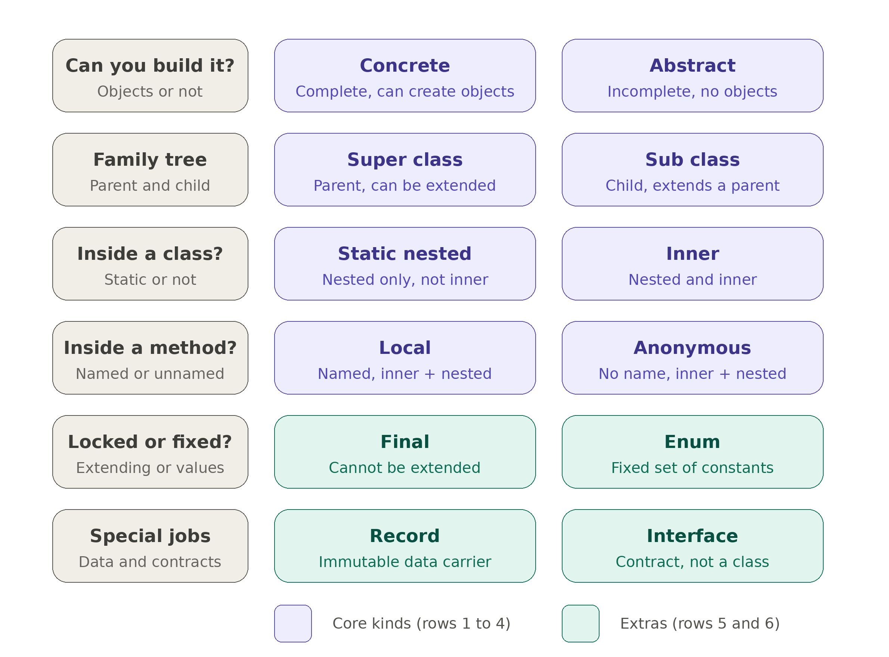

# Java Class Kinds

One runnable example for each kind of Java class: concrete, abstract, final, static nested, inner, local, anonymous, enum, record, interface, super class, and sub class.

Each file covers every modifier and clause that applies to that kind. Illegal cases are commented out with the reason.

## Memory map



Read each row left to right: the question on the left, then the two kinds that answer it. Rows 1 to 4 are the core kinds, and rows 5 and 6 are the extras.

## Requirements

Java 17 or newer.

## Run

```
java ConcreteClass.java
```

Or compile first:

```
javac ConcreteClass.java
java ConcreteClass
```

Each file is independent, so run them one at a time.
