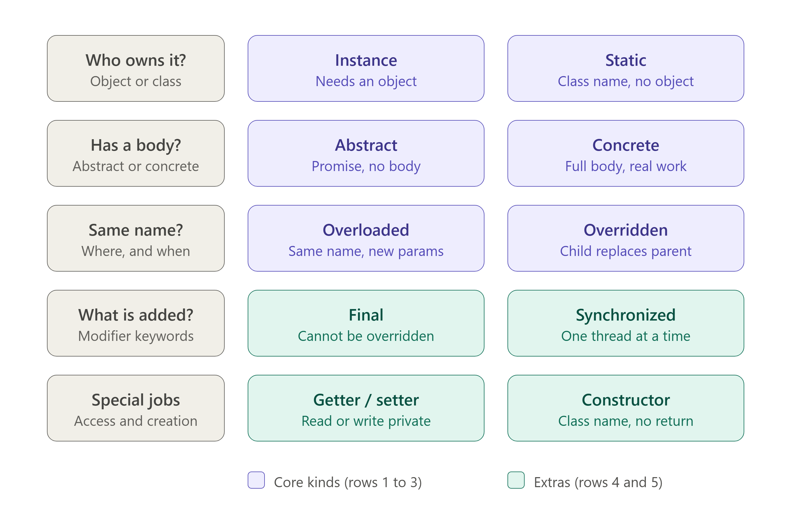

# Java Method Kinds

One runnable example for each kind of Java method: instance, static, abstract, final, overloaded, overridden, concrete, synchronized, getter/setter, and constructor.

Each file starts with a reference block (kinds, templates, keyword meanings), then a detailed explanation of that kind, then the runnable code. Illegal cases are commented out with an `x` and the reason.

## Memory map



Read each row left to right: the question on the left, then the two kinds that answer it. Rows 1 to 3 are the core kinds, and rows 4 and 5 are the extras.

## Generic template for a method

| Method | One-line definition with all its unique features |
|---|---|
| Instance method | A non-static method that belongs to an object, so it can only be called through an object (`new Class().m()`), has access to `this`, instance fields, and static members, works on that object's own data, can be overloaded, overridden (unless `final` or `private`), and combined with `final`, `synchronized`, or `abstract`. |
| Static method | A method declared with `static` that belongs to the class itself, is loaded once with the class, is called by the class name without an object, is shared by all objects, cannot use `this`, `super`, or instance members directly, can only be hidden (not overridden), cannot be `abstract`, can be overloaded, and is what `main` must be. |
| Abstract method | A method declared with the `abstract` keyword, no body, and a semicolon, which can only exist in an abstract class (or an interface, where it is implicitly `public abstract`), forces every concrete subclass to implement it, cannot be `private`, `static`, or `final`, cannot be called directly, and enables runtime polymorphism. |
| Final method | A method declared with `final` that can be inherited, called, and overloaded but never overridden by a subclass (or hidden, if `static`), cannot be `abstract`, and is used to lock behavior for safety and consistency. |
| Overloaded method | One of several methods with the same name in the same class (or inherited) that differ in parameter number, type, or order (a different return type alone is not enough), may differ in access modifier, return type, or exceptions, is chosen at compile time by the arguments (compile-time or static polymorphism), and works for instance methods, static methods, and constructors. |
| Overridden method | A subclass's own version of an inherited instance method with the same name and parameters, the same or a covariant return type, the same or wider visibility, and no broader checked exceptions, chosen at runtime by the object's actual type (runtime or dynamic polymorphism), usually marked `@Override`, able to call the parent's version with `super.`, and impossible for `final`, `static`, or `private` methods. |
| Concrete method | A method with a full body `{ ... }` that does real work, the opposite of abstract, found in any class (or as a `default`, `static`, or `private` method in an interface), which can be instance or static, can be inherited, and can be overridden unless it is `final` or `static`. |
| Synchronized method | A method declared with `synchronized` that lets only one thread run it at a time by taking a lock (the object's lock for instance methods, the class's lock for static ones), releases the lock automatically on exit even if an exception is thrown, is reentrant, lets different objects run in parallel since each has its own lock, is not inherited by an overriding method unless redeclared, cannot be used on constructors, and can cause blocking or deadlock. |
| Getter-Setter method | A pair of public instance methods following the `getX()`/`isX()` and `setX(value)` naming convention, where the getter takes no parameters and returns a private field and the setter takes one parameter and updates it (using `this.x = x`), providing encapsulation and data hiding, allowing validation or defensive copies, and allowing read-only (getter only) or write-only (setter only) access. |
| Constructor method | A special method with the same name as its class and no return type (not even `void`) that runs automatically once per `new` to initialize the object, is supplied by the compiler as a no-argument default if you write none, can be overloaded, can be `public`, `protected`, default, or `private` (as in singletons), can chain with `this(...)` or `super(...)` as the first statement (with an implicit `super()` otherwise), and is not inherited and cannot be `static`, `final`, `abstract`, `synchronized`, or overridden. |

## Requirements

Java 17 or newer.

## Run

```
java InstanceMethod.java
```

Each file is independent, so run them one at a time.
