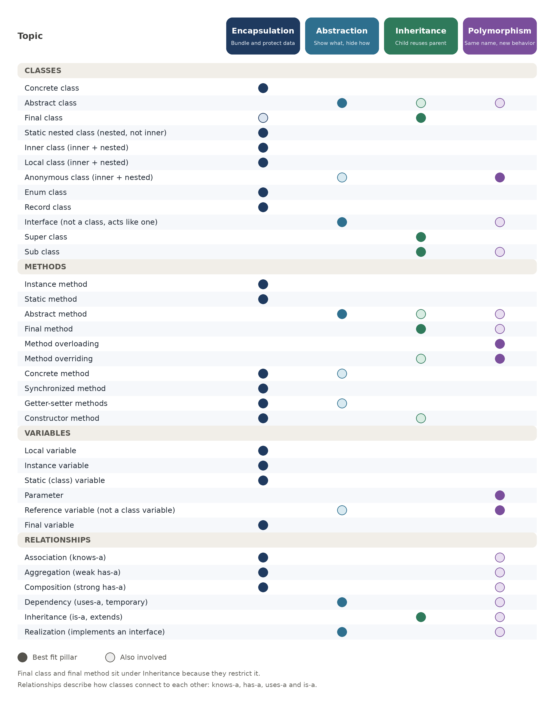
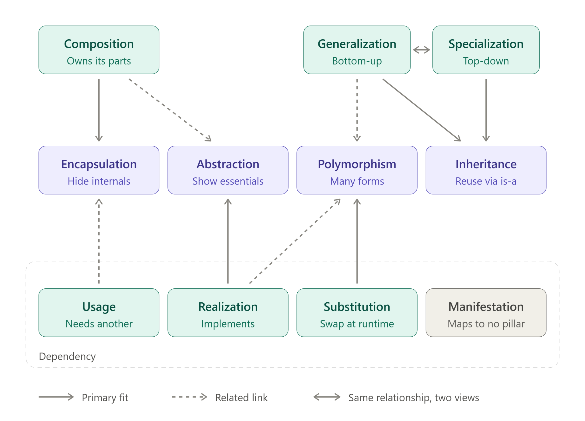

# Java OOP Pillars

A chart showing which OOP pillar each Java topic falls under. It covers 12 kinds of class, 10 kinds of method, 6 kinds of variable, and 6 relationships between classes. A second diagram links the relationships to the pillars.

## Pillars chart

Read each row left to right: the topic on the left, then the pillars it belongs to. A solid dot is the best-fit pillar, and a hollow dot means the topic is also involved.

## Relationships map

Green boxes are relationships and purple boxes are pillars. A solid arrow is the primary fit, a dashed arrow is a related link, and the two-headed arrow means the same relationship seen from two views (Generalization is bottom-up and Specialization is top-down). The dashed box marks the Dependency family, and Manifestation, in grey, maps to no pillar.

## The four pillars

| Pillar | One-line meaning |
|---|---|
| Encapsulation | Bundle data with the code that uses it, and protect it from outside access. |
| Abstraction | Show what something does and hide how it does it. |
| Inheritance | A child class reuses what its parent already has. |
| Polymorphism | The same name or type can behave differently depending on the situation. |

## Notes

- Final class and final method sit under Inheritance because they restrict it.
- Static method, static variable and parameter have no pillar of their own, so they are placed by their closest fit.
- Relationships describe how classes connect to each other: knows-a (association), has-a (aggregation and composition), uses-a (dependency), is-a (inheritance), and implements (realization).
