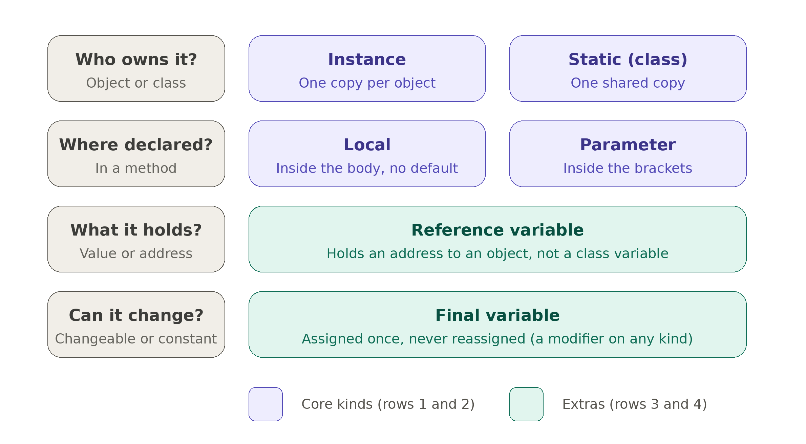

# Java Variable Kinds

One runnable example for each kind of Java variable: local, instance, static (class), parameter, reference, and final.

Each file starts with a reference block (kinds, templates, keyword meanings), then a detailed explanation of that kind, then the runnable code. Illegal cases are commented out with an `x` and the reason.

## Memory map



Read each row left to right: the question on the left, then the kinds that answer it. Rows 1 and 2 are the core kinds, and rows 3 and 4 are the extras.

## Requirements

Java 17 or newer.

## Run

```
java LocalVariable.java
```

Each file is independent, so run them one at a time.
